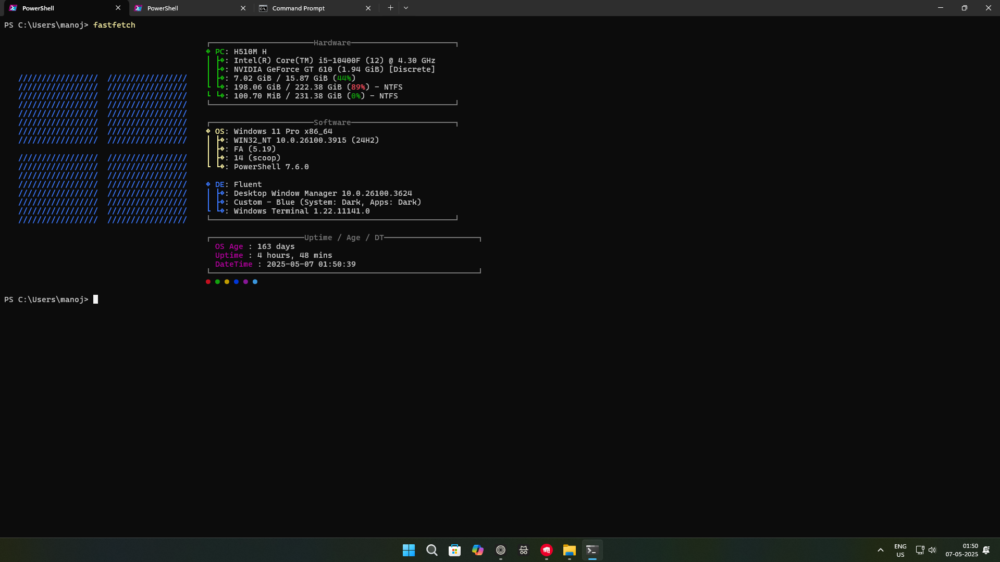

  

# fastfetch

Fastfetch config

## Credits gose to:

Reddit: [https://www.reddit.com/r/GarudaLinux/comments/1dcq0dl/...](https://www.reddit.com/r/GarudaLinux/comments/1dcq0dl/making_fastfetch_more_beautiful_linux/)

I used this reddit post and configure my windows config through by myself with the help of chatgpt [Fastfetch](https://github.com/fastfetch-cli/fastfetch)
